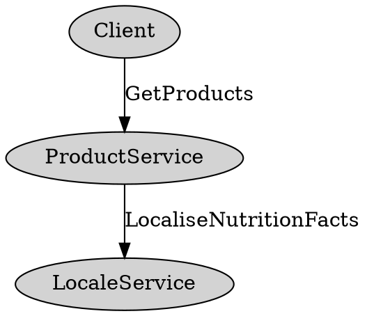

+++
title = "API 最佳实践"
weight = 100
description = "设计一个面向未来的 API 出奇地难。本文件中的建议在权衡取舍时更倾向于长期、无 bug 的演进。"
type = "docs"
aliases = "/programming-guides/api"
+++

已针对 proto3 更新。欢迎补丁！

本文档是
[Proto 最佳实践](./best-practices/dos-donts) 的补充。
它不是针对 Java/C++/Go 及其他 API 的规定。

如果你在代码评审中发现 proto 偏离了这些指南，请将作者指向本主题，帮助传播最佳实践。

{}
这些指南仅供参考，且许多有明确的例外。例如，如果你在编写性能关键的后端，可能会为了速度牺牲灵活性或安全性。本主题将帮助你更好地理解权衡，并做出适合你场景的决策。
{}

## 精确、简明地为大多数字段和消息编写文档 {#precisely-concisely}

你的 proto 很可能会被不了解你设计初衷的人继承和使用。请用对新团队成员或客户有用的术语为每个字段编写文档。

具体示例：

```proto
// 错误：启用 Foo 的选项
// 正确：控制 Foo 功能行为的配置。
message FeatureFooConfig {
  // 错误：设置是否启用该功能
  // 正确：必填字段，指示是否为 account_id 启用 Foo 功能。
  // 如果 account_id 的 FOO_OPTIN Gaia 位未设置，必须为 false。
  optional bool enabled;
}

// 错误：Foo 对象。
// 正确：API 中面向客户端的 Foo（what/foo）表示。
message Foo {
  // 错误：foo 的标题。
  // 正确：表示用户提供的 Foo 标题，无归一化或转义。
  // 示例标题："Picture of my cat in a box <3 <3 !!!"
  optional string title [(max_length) = 512];
}

// 错误：Foo 配置。
// 不如不写：如果最有用的注释只是重复字段名，最好省略注释。
FooConfig foo_config = 3;
```

用尽量少的文字描述每个字段的约束、期望和解释。

你可以使用自定义 proto 注解。
参见 [自定义选项](./programming-guides/proto2#options)
以定义跨语言常量，如上例中的 `max_length`。
proto2 和 proto3 均支持。

接口文档会随着时间变长，影响清晰度。文档不清时要修正，但要整体把握，追求简洁。

## 为传输和存储使用不同的消息 {#use-different-messages}

如果你暴露给客户端的顶层 proto 与存储在磁盘上的 proto 相同，未来会很麻烦。依赖 API 的二进制文件会越来越多，修改难度加大。你需要有更改存储格式而不影响客户端的自由。将代码分层，让模块只处理客户端 proto、存储 proto 或转换。

原因：你可能想更换底层存储系统，或以不同方式归一化/反归一化数据，或发现部分客户端 proto 适合存储在内存，部分适合磁盘。

对于嵌套在顶层请求或响应中的 proto，是否分离存储和传输 proto 取决于你愿意让客户端与这些 proto 紧密耦合的程度。

维护转换层有成本，但一旦有客户端并需要做存储变更，很快就能收回成本。

你可能会想“等需要时再分离”。但分离成本高、内部字段无处可加时，API 会积累客户端不理解或无意中依赖的字段。

从一开始就用不同的 proto 文件，团队就知道内部字段加在哪里，不会污染 API。早期，传输 proto 可以与存储 proto 完全一致，自动转换（如字节拷贝或 proto 反射）。proto 注解也可驱动自动转换。

以下情况可例外：

* 字段为常用类型，如 `google.type` 或 `google.protobuf`，可同时用作存储和 API。
* 服务极度性能敏感时，可为速度牺牲灵活性。若服务 QPS 没有百万级、延迟没到毫秒级，通常不属于例外。
* 满足以下全部条件：

    * 服务本身就是存储系统
    * 系统不基于客户端结构化数据做决策
    * 系统仅按客户端请求存储、加载、查询

    如果你实现的是日志系统或基于 proto 的通用存储包装器，建议让客户端消息尽可能透明地进入存储后端，避免依赖集中。可考虑用扩展或[通过 Web 安全编码二进制 proto 序列化将不透明数据编码为字符串](./best-practices/api#encode-opaque-data-in-strings)。

## 对变更操作，支持部分更新或仅追加更新，而非全量替换 {#support-partial-updates}

不要让 `UpdateFooRequest` 只接收一个 `Foo`。

如果客户端不保留未知字段，`GetFooResponse` 的最新字段会丢失，导致数据丢失。有些系统不保留未知字段。proto2 和 proto3 实现会保留，除非应用显式丢弃。一般来说，公共 API 应在服务端丢弃未知字段，防止安全攻击。例如，垃圾未知字段可能导致服务器在未来使用新字段时失败。

没有文档时，可选字段的处理是模糊的。`UpdateFoo` 会清除字段吗？这会导致客户端不知字段时数据丢失。不触碰字段？那客户端如何清除字段？都不好。

### 方案一：使用更新字段掩码 {#use-update-field-mask}

让客户端传递要修改的字段，并在更新请求中只包含这些字段。服务器只更新掩码指定的字段，其他字段保持不变。
掩码结构应与响应 proto 结构一致；如 `Foo` 包含 `Bar`，则 `FooMask` 包含 `BarMask`。

### 方案二：暴露更细粒度的变更方法 {#expose-more-narrow-mutations}

例如，不用 `UpdateEmployeeRequest`，而用：
`PromoteEmployeeRequest`、`SetEmployeePayRequest`、`TransferEmployeeRequest` 等。

自定义更新方法更易监控、审计和安全，也更易实现和调用。*太多*会增加 API 认知负担。

## 顶层请求或响应 proto 不要包含原始类型 {#dont-include-primitive-types}

本文件其他地方描述的许多陷阱都可通过此规则避免。例如：

让客户端区分存储中未设置的 repeated 字段和本次调用未填充，可通过将 repeated 字段包裹在消息中实现。

通用请求选项自然会因遵循此规则而出现。读写字段掩码也是如此。

顶层 proto 应几乎总是作为其他消息的容器，以便独立扩展。

即使现在只需一个原始类型，用消息包裹也便于后续扩展和复用。例如：

```proto
message MultiplicationResponse {
  // 错误：如果以后要返回复数，且 AdditionResponse 也返回同类型，怎么办？
  optional double result;

  // 正确：其他方法可复用此类型，且可随服务新增功能（单位、置信区间等）扩展。
  optional NumericResult result;
}

message NumericResult {
  optional double real_value;
  optional double complex_value;
  optional UnitType units;
}
```

顶层原始类型的例外：仅在字符串（或字节）编码 proto，且仅在服务器端构建和解析时可用。续页 token、版本信息 token 和 ID 可作为字符串返回，*前提是*字符串实际是结构化 proto 的编码。

## 永远不要用布尔型表示现在只有两种状态但未来可能扩展的字段 {#never-use-booleans-for-two-states}

如果用布尔型字段，确保它描述的确实是仅有的两种状态（永远如此，而非现在或近期）。通常，枚举、整型或消息的灵活性更值得。

例如，返回帖子流时，开发者可能需要根据 UX 当前设计指示帖子是否双栏显示。虽然现在只需布尔型，但未来 UX 可能引入两行、三栏、四宫格等。

```proto
message GooglePlusPost {
  // 错误：是否双栏显示此帖子。
  optional bool big_post;

  // 正确：客户端显示此帖子的渲染提示。
  // 客户端应据此决定如何突出显示帖子。缺省时假定默认渲染。
  optional LayoutConfig layout_config;
}

message Photo {
  // 错误：是否为 GIF。
  optional bool gif;

  // 正确：照片的文件格式（如 GIF、WebP、PNG）。
  optional PhotoType type;
}
```

为枚举添加新状态时要小心，避免混淆概念。

如果新状态引入了新的维度或暗示多种行为，几乎肯定需要另一个字段。

## 很少用整型字段做 ID {#integer-field-for-id}

用 int64 作为对象标识符很诱人。建议用字符串。

这样可在需要时更改 ID 空间，减少冲突风险。2^64 已不再那么大。

你也可以将结构化标识符编码为字符串，鼓励客户端将其视为不透明数据。仍需有 proto 支撑字符串，但可将 proto 序列化为字符串字段（Web 安全 Base64 编码），避免内部细节暴露给客户端。此时请遵循[下文](#encode-opaque-data-in-strings)的指南。

```proto
message GetFooRequest {
  // 要获取的 Foo。
  optional string foo_id;
}

// 序列化并 Web 安全 base64 编码到 GetFooRequest.foo_id 字段。
message InternalFooRef {
  // 只设置其中一个。已迁移的 Foo 用 spanner_foo_id，未迁移的用 classic_foo_id。
  optional bytes spanner_foo_id;
  optional int64 classic_foo_id;
}
```

如果你用自定义序列化方案将 ID 表示为字符串，后续会变得很混乱。因此，最好从一开始就用内部 proto 支撑字符串字段。

## 不要将需要客户端构造或解析的数据编码为字符串 {#dont-encode-data-in-a-string}

这样做传输效率低，proto 使用者负担重，文档阅读者困惑。客户端还要考虑编码方式：列表是否逗号分隔？不可信数据是否正确转义？数字是十进制吗？最好让客户端发送实际消息或原始类型。这样更紧凑、清晰。

当服务有多语言客户端时尤其糟糕。每个客户端都要选合适的解析器或构造器，甚至自己写。

更一般地，选择合适的原始类型。参见
[协议缓冲区语言指南](./programming-guides/proto2#scalar)中的标量值类型表。

### 不要在前端 proto 返回 HTML {#returning-html}

有 JavaScript 客户端时，容易在 API 字段中返回 HTML 或 JSON。这会让 API 与特定 UI 绑定，带来三大风险：

* “临时”非 Web 客户端会解析 HTML 或 JSON 获取数据，格式变更会导致脆弱性，解析不当还会有安全漏洞。
* Web 客户端若返回未清理的 HTML，容易遭受 XSS 攻击。
* 返回的标签和类依赖特定样式表和 DOM 结构。版本变更时，结构可能变化，导致旧客户端无法正确渲染新 HTML。对于频繁发布的项目，这不是边缘情况。

除首次页面加载外，通常应返回数据，由客户端模板生成 HTML。

## 通过 Web 安全编码二进制 proto 序列化将不透明数据编码为字符串 {#encode-opaque-data-in-strings}

如果你在客户端可见字段中编码*不透明*数据（如续页 token、序列化 ID、版本信息等），请注明客户端应将其视为不透明数据。*始终使用二进制 proto 序列化，不要用文本格式或自定义方案。*当你需要扩展不透明字段的数据时，如果不用 proto 序列化，最终会重造轮子。

定义内部 proto 保存要放入不透明字段的内容（即使只需一个字段），序列化为字节后 Web 安全 base64 编码到字符串字段。

极少数情况下，为了极致紧凑性可用自定义格式。

## 不要包含客户端不可能用到的字段 {#dont-include-fields}

API 只应描述如何与系统交互。包含其他内容只会增加理解负担。

过去常在响应 proto 返回调试数据，但现在有更好的做法。RPC 响应扩展（也叫“侧信道”）允许用一个 proto 描述客户端接口，另一个描述调试接口。

同样，过去为日志方便在响应 proto 返回实验名，约定客户端在后续操作中带回。现在推荐在分析流水线做日志关联。

例外：

如果你需要实时分析且机器预算有限，日志关联代价高，提前反规范化日志数据可能有利。如果需要让日志数据回传，作为不透明数据发送给客户端，并注明请求和响应字段。

**注意：** 如果每次请求都要返回或回传隐藏数据，说明你在隐藏服务的真实成本，这也不好。

## *极少*定义没有续页 token 的分页 API {#define-pagination-api}

```proto
message FooQuery {
  // 错误：数据在两次查询间变化时，这些策略会导致漏结果。在最终一致性存储（如 Bigtable）下，旧数据可能在新数据后出现。偏移和分页都假定有排序，降低灵活性。
  optional int64 max_timestamp_ms;
  optional int32 result_offset;
  optional int32 page_number;
  optional int32 page_size;

  // 正确：灵活！在 FooQueryResponse 返回此字段，客户端下次查询时传回。
  optional string next_page_token;
}
```

分页 API 最佳实践是用不透明续页 token（next_page_token），由内部 proto 支撑，序列化后用 `WebSafeBase64Escape`（C++）或 `BaseEncoding.base64Url().encode`（Java）编码。内部 proto 可包含多个字段，关键是带来灵活性，并可为客户端带来结果稳定性。

不要忘记将此 proto 字段视为不可信输入做校验（见[不透明数据编码为字符串](#encode-opaque-data-in-strings)）。

```proto
message InternalPaginationToken {
  // 跟踪已见 ID，完美召回但 token 变大，尤其是用户回翻时。
  repeated FooRef seen_ids;

  // 类似 seen_ids，但用 Bloom filter 节省字节，牺牲精度。
  optional bytes bloom_filter;

  // 合理的初步方案，后续可变更而不影响客户端。
  optional int64 max_timestamp_ms;
}
```

## 将相关字段分组为新 message，仅对高内聚字段嵌套 {#group-related-fields}

```proto
message Foo {
  // 错误：Foo 的价格和货币。
  optional int price;
  optional CurrencyType currency;

  // 更好：封装 Foo 的价格和货币。
  optional CurrencyAmount price;
}
```

只嵌套高内聚字段。如果字段确实相关，通常会一起在服务端传递，定义在一起更方便。例如：

```java
CurrencyAmount calculateLocalTax(CurrencyAmount price, Location where)
```

如果你的 CL 引入一个字段，且未来可能有相关字段，预先放入独立 message，避免如下情况：

```proto
message Foo {
  // 已弃用！请用 currency_amount。
  optional int price [deprecated = true];

  // Foo 的价格和货币。
  optional google.type.Money currency_amount;
}
```

嵌套 message 的问题在于，`CurrencyAmount` 可能在 API 其他地方复用，但 `Foo.CurrencyAmount` 不便复用。最坏情况下，`Foo.CurrencyAmount` 被复用，但混入了 Foo 特有字段。

虽然[松耦合](https://en.wikipedia.org/wiki/Loose_coupling)
通常是系统开发最佳实践，但设计 `.proto` 文件时未必适用。有时将两个信息单元紧耦合（嵌套）更合理。例如，当前看似通用的字段，未来可能加专用字段，嵌套可阻止他人随意复用。

```proto
message Photo {
  // 错误：PhotoMetadata 可能在 Photo 之外复用，最好不要嵌套，便于访问。
  message PhotoMetadata {
    optional int32 width = 1;
    optional int32 height = 2;
  }
  optional PhotoMetadata metadata = 1;
}

message FooConfiguration {
  // 正确：在 FooConfiguration 范围外复用 Rule 会导致与无关组件紧耦合，嵌套可避免。
  message Rule {
    optional float multiplier = 1;
  }
  repeated Rule rules = 1;
}
```

## 在读取请求中包含字段读取掩码 {#include-field-read-mask}

```proto
// 推荐：使用 google.protobuf.FieldMask

// 方案一：
message FooReadMask {
  optional bool return_field1;
  optional bool return_field2;
}

// 方案二：
message BarReadMask {
  // 要返回的 Bar 字段的 tag 编号。
  repeated int32 fields_to_return;
}
```

如用推荐的 `google.protobuf.FieldMask`，可用
`FieldMaskUtil`
([Java](./reference/java/api-docs/com/google/protobuf/util/FieldMaskUtil.html)/[C++](./reference/cpp/api-docs/google.protobuf.util.field_mask_util.md))
库自动过滤 proto。

读取掩码让客户端明确期望，控制返回数据量，后端也可只取所需数据。

可接受的替代方案是始终填充所有字段，即隐式读取掩码全为 true。proto 变大后代价高。

最糟糕的是隐式（未声明）读取掩码，随方法不同而变化。此反模式会导致客户端用响应 proto 构建本地缓存时出现数据丢失。

## 在读取请求中包含版本字段以实现一致性读取 {#include-version-field}

客户端写后紧跟读同一对象时，期望读到刚写的数据——即使底层存储不保证。

服务器会读取本地值，若本地 version_info 小于期望值，则从远程副本读取最新值。通常 version_info 是
[proto 编码为字符串](#encode-opaque-data-in-strings)，包含变更数据中心和提交时间戳。

即使底层存储一致，通常也希望用 token 触发更昂贵的一致性读取，而不是每次都走一致性路径。

## 对返回相同数据类型的 RPC 使用一致的请求选项 {#use-consistent-request-options}

一个失败模式是：服务的每个 RPC 都返回相同数据类型，但请求选项各自为政，如最大评论数、支持的嵌入类型等。

这种做法会增加客户端填写请求的复杂度，也增加服务端将 N 个请求选项转换为统一内部选项的复杂度。许多实际 bug 都源于此。

更好的做法是：创建单独的消息保存请求选项，并在每个顶层请求消息中包含。例如：

```proto
message FooRequestOptions {
  // 字段级读取掩码。只返回请求的字段。客户端应只请求所需字段，帮助后端优化。
  optional FooReadMask read_mask;

  // 每个 Foo 返回的评论数上限。被标记为垃圾的评论不计入。默认不返回评论。
  optional int max_comments_to_return;

  // 不在此支持类型列表中的嵌入会被降级为列表中的嵌入。未指定则不返回嵌入。无法降级的也不返回。强烈建议客户端始终包含 EmbedTypes.proto 的 THING_V2。
  repeated EmbedType embed_supported_types_list;
}

message GetFooRequest {
  // 要读取的 Foo。无权限或已删除则响应为空但成功。
  optional string foo_id;

  // 客户端必须包含此字段。为空则服务器返回 INVALID_ARGUMENT。
  optional FooRequestOptions params;
}

message ListFooRequest {
  // 要返回哪些 Foo。搜索保证 100% 召回，但条件越多性能越差。
  optional FooQuery query;

  // 客户端必须包含此字段。为空则服务器返回 INVALID_ARGUMENT。
  optional FooRequestOptions params;
}
```

## 批量/多阶段请求 {#batch-multi-phase-requests}

尽量让变更操作原子化。更重要的是让
[变更操作幂等](#prefer-idempotency)。部分失败重试不应导致数据损坏或重复。

有时为性能需单个 RPC 封装多操作。部分失败时怎么办？最好让客户端知晓成功和失败详情。

可将 RPC 标记为失败，并在 RPC 状态 proto 中返回成功和失败详情。

总之，未了解部分失败处理的客户端应能正确工作，了解的客户端可获得更多价值。

## 创建返回或操作小数据块的方法，鼓励客户端批量组合请求 {#create-methods-manipulate-small-bits}

允许客户端在一次往返中查询多个小数据块，可在不改服务器的情况下支持更多 UX 选项。

这对前端和中间层服务器尤为重要。

许多服务都暴露了自己的批量 API。

## 当移动或 Web 客户端需串行往返时，创建一次性 RPC {#make-one-off-rpc}

当*Web 或移动*客户端需做两次有数据依赖的查询时，最佳实践是创建新 RPC，避免多次往返。

对移动端，几乎总是值得将两个服务方法合并为一个，节省一次往返。对服务间调用，则视性能敏感度和新方法带来的认知负担而定。

## repeated 字段应为消息类型，而非标量或枚举 {#repeated-fields-messages-scalar-types}

常见演进是单一 repeated 字段需变为多个相关 repeated 字段。若一开始用 repeated 原始类型，后续只能用并行 repeated 字段，或新建 repeated 消息字段并迁移客户端。

若一开始用 repeated 消息，演进就很简单。

```proto
// 描述应用于照片的增强类型
enum EnhancementType {
  ENHANCEMENT_TYPE_UNSPECIFIED;
  RED_EYE_REDUCTION;
  SKIN_SOFTENING;
}

message PhotoEnhancement {
  optional EnhancementType type;
}

message PhotoEnhancementReply {
  // 正确：PhotoEnhancement 可扩展描述更多字段。
  repeated PhotoEnhancement enhancements;

  // 错误：若需返回增强参数，只能用并行数组（很糟）或弃用此字段并引入 repeated 消息。
  repeated EnhancementType enhancement_types;
}
```

假设有新需求：“我们需要知道哪些增强是用户操作，哪些是系统自动应用。”

若 `PhotoEnhancementReply` 的 enhancement 字段是标量或枚举，支持起来会很难。

map 也一样。若值已是消息类型，后续加字段更容易；否则要从 `map<string, string>` 迁移到 `map<string, MyProto>`。

例外：

对延迟极敏感的应用，原始类型并行数组比消息数组更快、更省空间（用 [[packed=true]](./programming-guides/encoding#packed) 可省略字段标签）。分配固定数量数组比分配 N 个消息更省事。
[Proto3](./programming-guides/proto3) 默认打包，无需显式指定。

## 使用 Proto Map {#use-proto-maps}

在
[Proto3](./programming-guides/proto3) 引入
[Proto3 map](./programming-guides/proto3#maps) 前，服务常用 KVPair 消息配合标量字段表示数据。后续客户端需更深结构时，只能解析 key 或 value。参见
[不要将数据编码为字符串](#dont-encode-data-in-a-string)。

用（可扩展的）消息类型做 value 立刻优于原始设计。

map 已回移植到 proto2，故用 `map<scalar, **message**>` 比自造 KVPair 更好[^3]。

[^3]: proto 中含 `map<k,v>` 字段时，不要用作 MapReduce 的 reduce key。proto3 map 项的线性化和迭代顺序*未定义*，会导致 map 分片不一致。

若需表示*任意*未知结构的数据，用
[`google.protobuf.Any`](./reference/protobuf/textformat-spec#any)。

## 优先保证幂等性 {#prefer-idempotency}

调用栈上方可能有重试逻辑。若重试是变更操作，用户可能遇到重复评论、构建请求、编辑等问题。

避免重复写入的简单方法是允许客户端指定请求 ID，服务器去重（如内容哈希或 UUID）。

## 注意服务名，确保全局唯一 {#service-name-globally-unique}

服务名（即 `.proto` 文件中 `service` 关键字后的部分）用途远超生成服务类名。

问题在于，许多工具假定服务名在网络中唯一，且用*非限定*服务名（如 `MyService`），而非限定名（如 `my_package.MyService`）。

因此，即使服务定义在特定包内，也要防止命名冲突。例如，`Watcher` 可能引发问题，`MyProjectWatcher` 更好。

## 限定请求和响应大小 {#bound-req-res-sizes}

请求和响应大小应有限制。
推荐上限约 8 MiB，2 GiB 是许多 proto 实现的硬限制。
许多存储系统也有限制。

否则会：

-   增大客户端和服务器负担，
-   导致高且不可预测的延迟，
-   降低弹性，因依赖单客户端与单服务器的长连接。

限定 API 消息大小的几种方式：

-   定义返回有界消息的 RPC，每次调用逻辑独立。
-   定义只操作单对象的 RPC，避免操作无界对象列表。
-   避免在 string、bytes 或 repeated 字段中编码无界数据。
-   定义长时间运行操作，将结果存储在可扩展并发读取的存储系统。
-   用分页 API（见[分页 API](#define-pagination-api)）。
-   用流式 RPC。

如为 UI 开发，也请参见
[创建返回或操作小数据块的方法](#create-methods-manipulate-small-bits)。

## 谨慎传播状态码 {#propagate-status-codes}

RPC 服务应在 RPC 边界仔细检查错误，并向调用者返回有意义的状态错误。

举例说明：

假设客户端调用 `ProductService.GetProducts`，无参数。`GetProducts` 可能获取所有产品，并为每个产品调用 `LocaleService.LocaliseNutritionFacts`。



若 `ProductService` 实现错误，可能向 `LocaleService` 传错参数，导致 `INVALID_ARGUMENT`。

若 `ProductService` 粗心地将错误返回给调用者，客户端会收到 `INVALID_ARGUMENT`，但客户端并未向 `GetProducts` 传参。此错误毫无意义，只会引发混乱！

正确做法是：`ProductService` 应在 RPC 边界检查错误。若*收到*无效参数，应返回 `INVALID_ARGUMENT`。若*下游*收到无效参数，应将 `INVALID_ARGUMENT` 转为 `INTERNAL` 再返回。

错误传播不当会导致难以调试的混乱，甚至导致所有服务都转发客户端错误而无告警，形成“隐形故障”。

总之，在 RPC 边界要仔细检查错误，向调用者返回有意义的状态码。每个 RPC 方法应文档化其错误码及触发条件，方法实现应符合 API 合同。

## 每个方法创建唯一的 proto {#unique-protos}

每个 RPC 方法都应有唯一的请求和响应 proto。后续若需分离顶层请求或响应，代价很高。包括“空”响应；应创建唯一的空响应 proto，而非复用[知名 Empty 消息类型](https://github.com/protocolbuffers/protobuf/blob/main/src/google/protobuf/empty.proto)。

### 复用消息 {#reuse-messages}

如需复用消息，创建共享的“领域”消息类型，在多个请求和响应 proto 中包含。应用逻辑应基于这些类型，而非请求/响应类型。

这样可独立演进方法请求/响应类型，同时复用逻辑子单元代码。

## 附录 {#appendix}

### 返回 repeated 字段 {#returning-repeated-fields}

当 repeated 字段为空时，客户端无法区分是服务器未填充还是数据本为空。即 repeated 字段没有 `hasFoo` 方法。

用消息包裹 repeated 字段即可获得 hasFoo 方法。

```proto
message FooList {
  repeated Foo foos;
}
```

更全面的解决方案是用字段
[读取掩码](#include-field-read-mask)。若请求了该字段，空列表表示无数据；未请求则客户端应忽略响应中的字段。

### 更新 repeated 字段 {#updating-repeated-fields}

最糟糕的做法是强制客户端提供替换列表。这样会导致多种问题：不保留未知字段的客户端会丢数据；并发写入会丢数据。即使没有这些问题，客户端也需仔细阅读文档以理解服务器如何解释字段。空字段是表示不更新还是清空？

**方案一**：用 repeated 更新掩码，允许客户端替换、删除或插入元素，无需提供完整数组。

**方案二**：在请求 proto 中创建单独的追加、替换、删除数组。

**方案三**：只允许追加或清空。可用消息包裹 repeated 字段。消息存在但为空表示清空，否则有元素表示追加。

### repeated 字段的顺序无关性 {#order-independence-repeated-fields}

*尽量*避免顺序依赖。顺序依赖增加脆弱性。尤其是并行数组，客户端难以解释结果，服务端传递相关字段也不自然。

```proto
message BatchEquationSolverResponse {
  // 错误：解的顺序与请求方程顺序一致。
  repeated double solved_values;
  // （通常）错误：solved_values 的并行数组。
  repeated double solved_complex_values;
}

// 正确：单独消息可扩展，且可被其他方法复用。请求与响应间、多个 repeated 字段间无顺序依赖。
message BatchEquationSolverResponse {
  // 已弃用，Q2 2014 前继续填充，之后客户端必须用 solutions 字段。
  repeated double solved_values [deprecated = true];

  // 正确：请求中每个方程有唯一标识符，EquationSolution 中包含，便于关联。方程并行求解，解生成后加入数组。
  repeated EquationSolution solutions;
}
```

### 因 proto 被打包进移动端导致功能泄露 {#leaking-features}

Android 和 iOS 运行时都支持反射。为此，字段和消息的未过滤名称会作为字符串嵌入应用二进制（APK、IPA）。

```proto
message Foo {
  // 这会在 Android 和 iOS 泄露 Google Teleport 项目存在
  optional FeatureStatus google_teleport_enabled;
}
```

几种缓解策略：

* Android 用 ProGuard 混淆。iOS 无混淆选项：拿到 IPA 后用 `strings` 就能看到字段名。
  [iOS Chrome 拆包](https://github.com/Bensge/Chrome-for-iOS-Headers)
* 精确筛选发送到移动端的字段。
* 若无法及时堵住泄露，与功能所有者达成风险共识。

*绝不要*用代号混淆字段含义。要么堵住泄露，要么获得风险共识。

### 性能优化 {#performance-optimizations}

有时可为性能牺牲类型安全或清晰度。例如，含数百字段（尤其是消息字段）的 proto 解析慢，深层嵌套消息仅因内存管理也慢。加速反序列化的常用技巧：

* 创建并行精简 proto，镜像大 proto 但只声明部分标签。解析时只用精简 proto。加测试确保标签号一致。
* 用
  [[lazy=true]](https://github.com/protocolbuffers/protobuf/blob/cacb096002994000f8ccc6d9b8e1b5b0783ee561/src/google/protobuf/descriptor.proto#L609)
  注解字段为“延迟解析”。
* 声明字段为 bytes 并注明类型。关心的客户端可手动解析。风险是无法防止放错类型的消息。写入日志的 proto 切勿用此法，否则无法检查 PII 或做策略/隐私清理。
